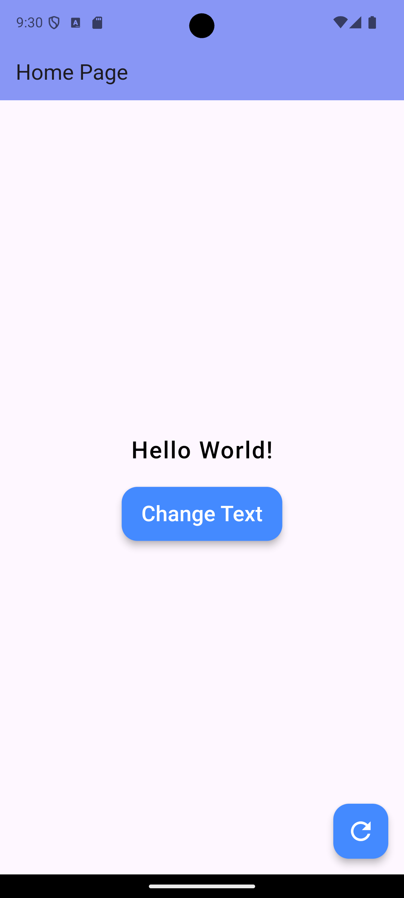

# My First App - Flutter Example

This is a simple Flutter application demonstrating the use of both `StatelessWidget` and `StatefulWidget`, basic UI elements, state management, and interactive components. The app consists of a homepage with a dynamic text display and a button that changes the text when pressed.

## Features:
- A `MaterialApp` widget as the root of the application.
- A `HomePage` with dynamic text that toggles between two messages.
- An `ElevatedButton` that allows users to change the text displayed on the screen.
- A `FloatingActionButton` that performs the same action (change text) when pressed.
- A custom `AppBar` with a title and an elevation effect for a clean UI.

## Project Structure:
- **`main.dart`**: The main entry point of the Flutter app containing all necessary widgets and UI logic.
  - **`MyApp`**: A `StatelessWidget` that represents the root widget of the application.
  - **`HomePage`**: A `StatefulWidget` that represents the home screen where dynamic content changes.
  - **`_HomePageState`**: The state class for `HomePage` that manages the dynamic text and button actions.

## Dependencies:
- **`flutter`**: The core Flutter framework is required to run the application.

## Screenshots:

Here are some screenshots of the project:

### Screenshot 1

You can see how the UI looks when using the application.